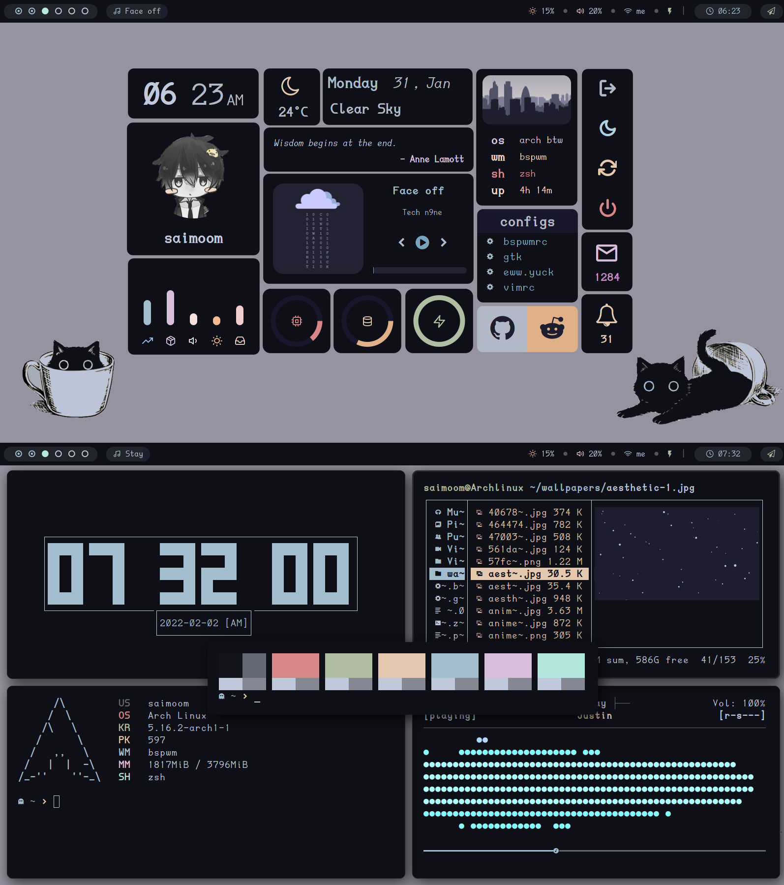

<h3 align="center">
	 </h3>

    

    
    <a href="https://github.com/saimoomedits/levuaska/network/members/">
        
    
    

<h3 align="center">
                                        </h3>

<h2 align="center">Bspwm dotfiles weeeeee</h2>

### well hello there fellow linux user 🐧

### what is this all about? hmm? 🧐
Levuaska, is a **WIP** dark color scheme that I made for fun, its heavily inspired by [catppuccin](https://github.com/catppuccin/catppuccin). and idk what else to say...
	

	
	

	
**important things~**
	
- **OS** : Arch 🤓 ***btw***
- **WM** : BSPWM 🪟 **best wm**
- **COLOR** : Levuaska 🖌️ **bootiful**
- **GTK-THEME** : Levuaska(WIP) ⛰️ **based on owl4ce's Fleon gtk theme**
- **FILE-BROWSER** : ranger 🦾 **simple yet customizable**
- **MUSIC-PLAYER** : [mpd](https://www.musicpd.org/) 🎵 **high quality "never gonna give you up"**
- **WEB-BROWSER** : firefox 🦊 **fox on 🔥**
- **APPLICATION-LAUNCHER** : [Rofi](https://github.com/davatorium/rofi) 🚀 **blazing fast**
- **BAR** : [Polybar](https://github.com/polybar/polybar) 😃 **easy to configure**
- **TERMINAL** : Urxvt 😎 **256 colors**
- **PRF-VIEWER** : [Zathura](https://github.com/pwmt/zathura) 📓 **simple**
- **NOTIFICATIONS** : [Dunst](https://dunst-project.org/) 🔔 **customizable notifications**
- **FONTS** : Feather(for icons), [DaddyTimeMono Nerd Font](https://github.com/ryanoasis/nerd-fonts/releases/download/v2.1.0/DaddyTimeMono.zip)

## Screenshots 🖼️
<h3 align="center"></h3>
<h3 align="center"></h3>
<h3 align="center"></h3>
<h3 align="center"></h3>

## credits
* **adi190x**
* **rxhyn**
* **owl4ce**
